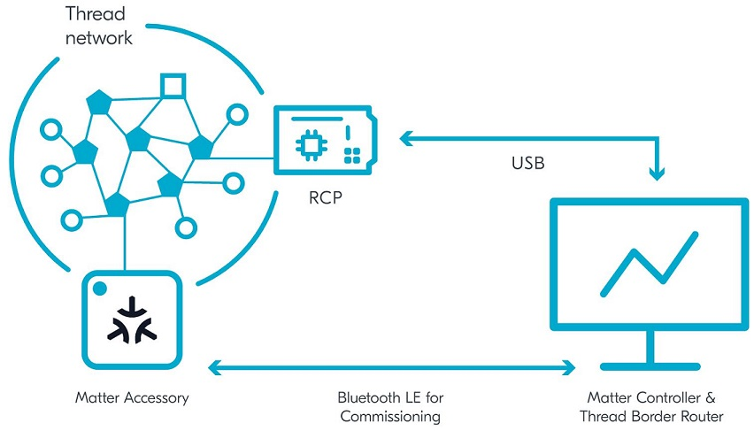

# Matter

This document describes the set-up of a matter demos. It is possible to setup different development environments. In this article we will focus on a setup with OpenTread Border Router and Matter controller on the same device, as shown in the following figure. 

More development environments are described here:
https://developer.nordicsemi.com/nRF_Connect_SDK/doc/latest/nrf/ug_matter_configuring.html#

## Setup the Development Environment

In our setup we will use a Raspberry PI and run an OTBR and the Matter Controller on it. So let's start and prepare it. 

